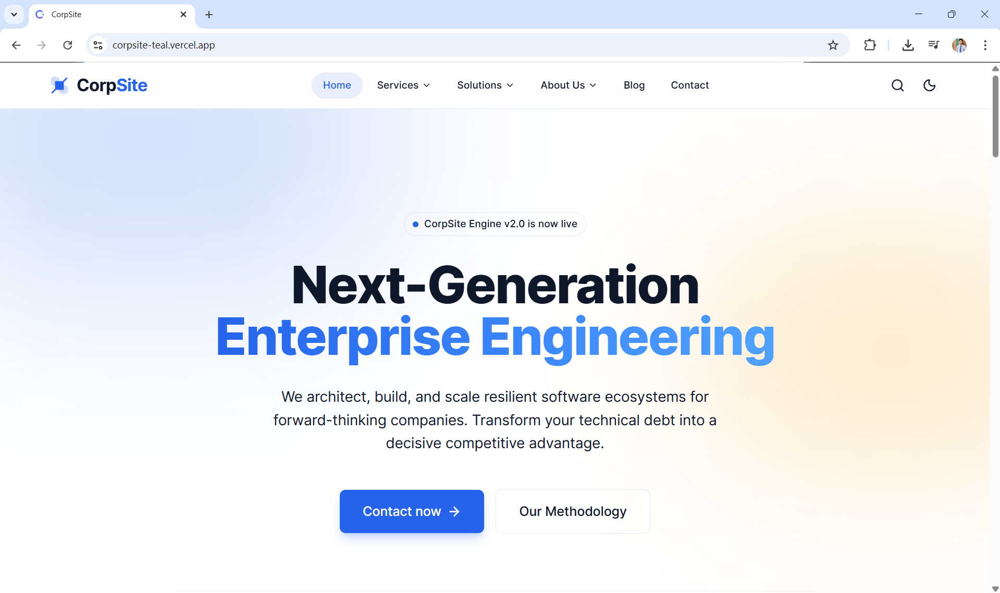
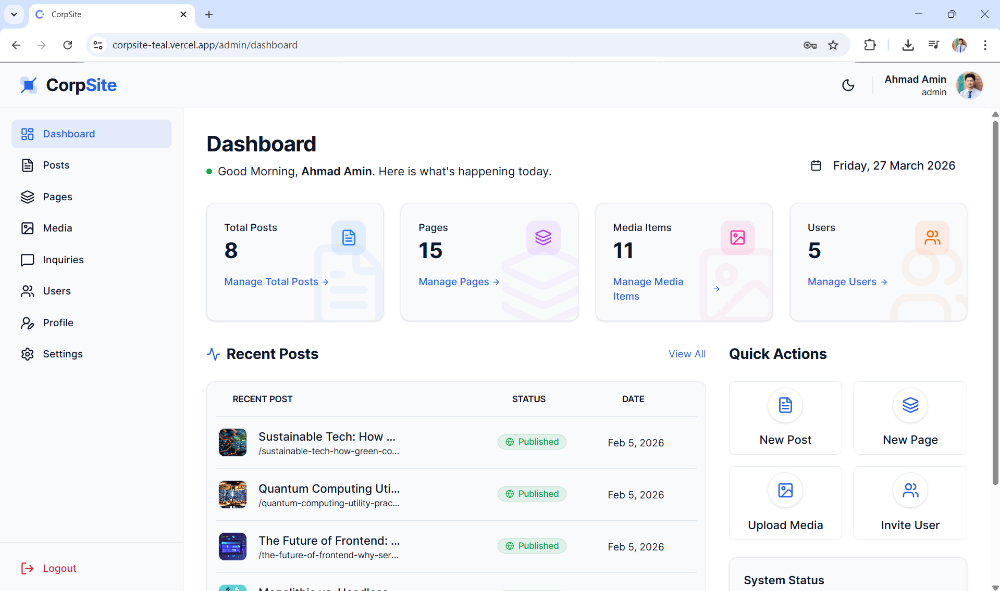
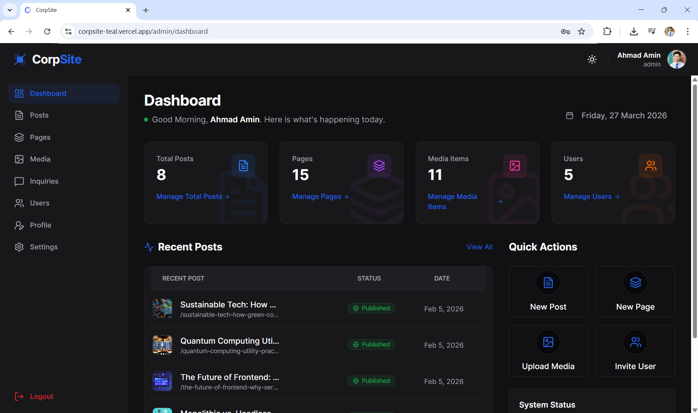

# CorpSite Frontend

A React + Vite frontend for a corporate website and its admin dashboard. This project works with a separate [Backend API](https://github.com/AhmadAmin5/corpSite-Backend) and provides both the public-facing website and a protected content management interface.

The frontend is built for a headless CMS-style setup, where content and system data are managed through the backend, while this application handles the user interface, routing, state management, and content editing experience.

**Live Website:** [https://corpsite-teal.vercel.app](https://corpsite-teal.vercel.app/)  
> This is the current live deployment at the time of writing. It may be changed, moved, or unavailable in the future.

Developed by [M Ahmad Amin](https://github.com/AhmadAmin5)

You may want to check [Backend Code](https://github.com/AhmadAmin5/CorpSite-Backend) for this Frontend.

## Overview

This frontend includes:

- Public website pages such as Home, About, Services, Solutions, Contact, and Blog
- Dynamic blog post and page rendering
- Protected admin area with role-based access
- Authentication and account activation flow
- User, media, post, page, inquiry, category, menu, and settings management
- Rich content rendering and editing support

## Screenshots

#### Client
  

*Screenshot of Home page*

### Admin Dashbaord

  

*Screenshot of Admin Dashbaord (both light and dark theme)*

## Tech Stack

- React
- Vite
- React Router
- Redux Toolkit
- RTK Query
- Axios
- Tailwind CSS
- React Hook Form
- BlockNote Editor

## Getting Started

### Prerequisites

Make sure you have the following installed:

- Node.js
- npm

### 1. Install dependencies

```bash
npm install
```

### 2. Configure environment variables

Create a `.env` file in the project root and add:

```env
VITE_API_BASE_URL=your_backend_api_url
```

You can copy the variable name from `.env.sample`.

### 3. Run the development server

```bash
npm run dev
```

### 4. Build for production

```bash
npm run build
```

### 5. Preview production build

```bash
npm run preview
```

## Available Scripts

```bash
npm run dev      # Start development server
npm run build    # Create production build
npm run preview  # Preview production build
npm run lint     # Run ESLint
npm run format   # Format code with Prettier
```

## Key Features

### Public Website
- Multi-page public website with client-side routing
- Blog listing, filtering, pagination, and individual post pages
- Dynamic page rendering for CMS-managed content
- Contact form submission

### Admin Dashboard
- Protected admin routes
- Role-based access for admin, manager, and editor workflows
- Manage users, media, blog posts, pages, and contact inquiries
- Site settings and menu management

### Authentication
- Login and account activation flows
- Persistent auth state using local storage
- Token refresh scheduling for better session handling

### Content Management Experience
- Rich text content rendering with BlockNote
- Slug generation helpers for content creation
- Featured image selection and publishing controls
- Clean modular API layer for backend integration

## Project Structure

```bash
src/
├── api/          # Axios setup, base query, token refresh scheduler
├── app/          # Redux store setup
├── components/   # Reusable UI and feature components
├── config/       # Roles and shared configuration
├── context/      # Global providers such as toast context
├── features/     # RTK Query API slices by domain
├── hooks/        # Custom hooks
├── layouts/      # Route layouts
├── pages/        # Public, auth, admin, and error pages
├── routes/       # Router configuration
```

## Notes

- This frontend expects the backend API to be available through `VITE_API_BASE_URL`.
- The public website and admin dashboard are served from the same application.
- Routes are lazy-loaded to keep the app more efficient.
